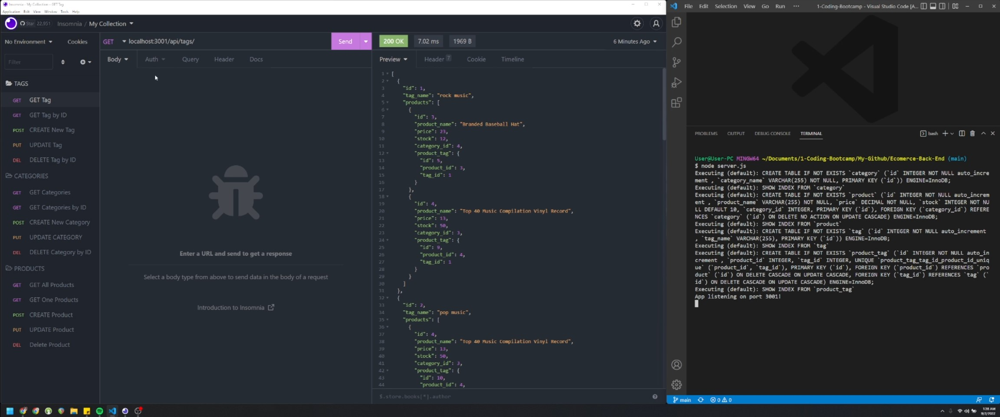

# Ecommerce-Back-End - Module 13 Challenge

Backend of your next business

## Mock Up



This is my completed code for the Module 13 challenge this week. We were given a task this week to build the back end for an e-commerce site using a working Express.js API and configure it to use Sequelize to interact with a MySQL database.

## User Story

```
AS A manager at an internet retail company
I WANT a back end for my e-commerce website that uses the latest technologies
SO THAT my company can compete with other e-commerce companies
```

The Acceptance Criteria is as follows:

## Acceptance Criteria

```
GIVEN a functional Express.js API
WHEN I add my database name, MySQL username, and MySQL password to an environment variable file
THEN I am able to connect to a database using Sequelize
WHEN I enter schema and seed commands
THEN a development database is created and is seeded with test data
WHEN I enter the command to invoke the application
THEN my server is started and the Sequelize models are synced to the MySQL database
WHEN I open API GET routes in Insomnia Core for categories, products, or tags
THEN the data for each of these routes is displayed in a formatted JSON
WHEN I test API POST, PUT, and DELETE routes in Insomnia Core
THEN I am able to successfully create, update, and delete data in my database
```

This application utilizes Express, MYSQL2, Sequelize, and dotenv. To run the app on localhost, just enter `node server.js` after entering `npm i`, `source schema.sql` while logged into mySQL, and `npm run seed`.

## Please see attached links to Repository and Video Walkthrough:

### https://github.com/jdanleano/Ecommerce-Back-End

### https://youtu.be/uZUGo50QGJg
